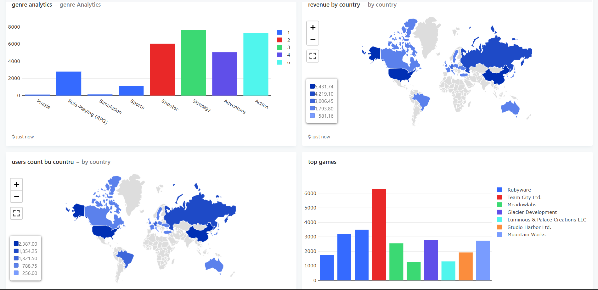

# data_analytics_FEFU

Это проект для курса по аналитике данных в ДВФУ

## Описание проекта

Проект симулирует работу интернет магазина игр и содержит в себе следующее:
- таблица пользователей с полями последней активности, количества потраченных средств и др.;
- таблица библиотек игр соответствующих каждому пользователю;
- таблица игр, сожержащая стоимость игры, жанр, год выхода, разработчика и др.;
- таблица разработчиков, нужная в основном для контроля общего дохода;
- таблица транзакций, контролирующая продажи игр;
- генератор данных и планировщик ответственный за своевременное использование генератора. Планировщик устроен так, что 1 минута релаьного времени равна 1 дню в симуляции.

## Примерное описание работы
- После поднятия докера планировщик сгенерирует стартовые данные (10_000 пользователей, 10 разработчиков и случайное число игр от 10 до 30), количество можно изменить в скрипте ```generator/scheduler.py```
- Затем магазин начнет жить своей жизнью, постепенно пользователи будут расти, появляться новые разработчики, выпускаться игры. Раз в один симулированный месяц просиходит удаление неактивных пользователей.

## Быстрый старт

1. Клонировать репозиторий командой 
```bash
git clone https://github.com/ByterGame/data_analytics_FEFU
```
2. Запустить контейнеры командой (команда может отличаться в зависимости от системы)
```bash
docker-compose up --build
```
3. После запусков всех контейнеров вы можете перейти по адресу http://localhost:5000 для дальнейшей визуализации данных в redash.
## Параметры для подключения базы данных в redash:
- name - на ваш выбор
- host - postgres
- port - 5432
- user - postgres
- password - postgres
- dbname - postgres
## Аналитика с помощью Jupiter notebook
Файл с примером аналитики с помощью Jupiter notebook вы сможете найти по пути ```notebook/analytics```. Убедитесь, что на порту 5432 крутиться именно база данных именно этого проекта.

## Пример дэшборда в redash
